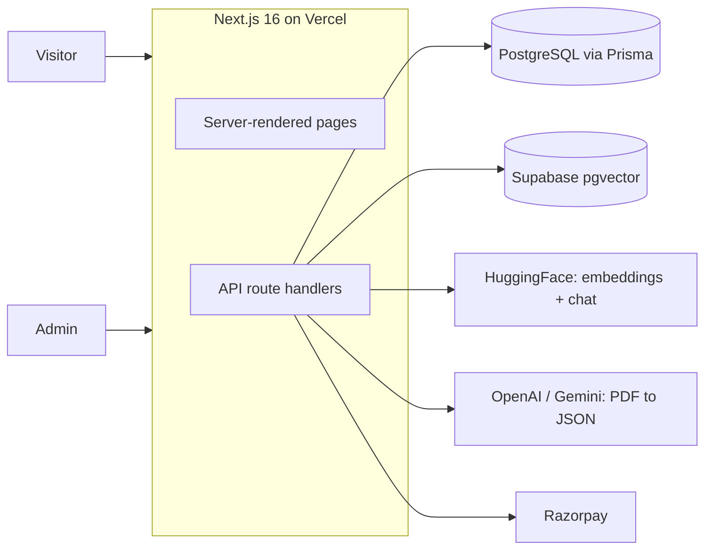

# KarmaVriti

**Latest government jobs, results, admit cards and exam updates for India, with an AI assistant that answers questions from official notices.**

Live site: [karma-vriti.vercel.app](https://karma-vriti.vercel.app)


---

## Overview

KarmaVriti is a job portal for Indian government recruitment. Visitors can browse notifications, results, admit cards, answer keys and syllabus pages. Admins publish content through a protected console, with AI help to turn notice PDFs into structured job data. A RAG-based assistant lets visitors ask questions in plain language and get answers with source links.

## Features

**For visitors**
- Job listings by category: SSC, Railway, Banking, UPSC, Defence, Police, Teaching, State and Central Government, PSU
- Search and filters (category, location, status), with infinite scroll
- Pages for results, admit cards, answer keys and syllabus, each linked to its job
- SEO-first rendering: server-rendered pages, sitemap, robots and structured data (JSON-LD)
- AI assistant and semantic search, answering from official notices and job data

**For admins**
- Secure login (JWT in an httpOnly cookie, roles `ADMIN` and `SUPER_ADMIN`)
- Create, edit and approve jobs; content moves from `preview` to `upcoming` or `active`
- **PDF to job**: upload a notice, extract text (with OCR for scans), and let an LLM fill the job form for review
- Bulk import of jobs from JSON with field mapping
- Draft syllabus, admit card, answer key and result pages are auto-created and linked to each new job
- Upload PDFs to the AI knowledge base and re-index jobs and syllabus

## Architecture



The app is a single Next.js deployment (UI and API together). State lives in managed services, so the compute layer is stateless.

## Tech stack

| Area | Technology |
| --- | --- |
| Framework | Next.js 16 (App Router), React 19, TypeScript 5 |
| Styling and UI | Tailwind CSS 4, framer-motion, lucide-react |
| Data fetching | TanStack Query |
| Database | PostgreSQL with Prisma 7 (`@prisma/adapter-pg`) |
| Auth (admin) | bcryptjs, JWT via `jose` |
| AI | LangChain (JS), HuggingFace Inference, Supabase pgvector |
| Document processing | `unpdf`, Tesseract.js (English + Hindi OCR) |
| PDF to JSON | OpenAI `gpt-4o-mini` or Gemini 1.5 Flash (Ollama `llama3` in development) |
| Payments | Razorpay (Stripe is legacy) |
| Hosting and CI | Vercel (Mumbai region), GitHub Actions |

## AI assistant (RAG)

1. **Ingest.** An admin uploads a notice PDF. Text is extracted with `unpdf`, falling back to Tesseract OCR for scanned files. The text is split into 1000-character chunks (200 overlap), embedded with `sentence-transformers/all-MiniLM-L6-v2` and stored in Supabase pgvector. Active jobs and syllabus pages can also be indexed.
2. **Ask.** `POST /api/ai/query` embeds the question, retrieves the top 5 chunks, adds matching jobs from PostgreSQL for fresh dates and vacancies, and asks `Qwen/Qwen2.5-7B-Instruct` (HuggingFace) to answer from that context.
3. **Respond.** The answer comes back with source links.

In development, if no HuggingFace token is set, chat falls back to a local Ollama model.

> A Python/FastAPI + Chroma prototype of the same idea lives in `backend/`. The web app does not use it.

## Getting started

### Prerequisites

- Node.js 20 or newer
- A PostgreSQL database (local, Supabase or Neon)
- Optional, for the AI features: a Supabase project and a HuggingFace access token

### Setup

```bash
git clone https://github.com/ApurvRj/KarmaVriti.git
cd KarmaVriti

# Vercel installs with --legacy-peer-deps; use it if npm reports peer conflicts
npm install --legacy-peer-deps

# Create your environment file (see the table below)
# Use ".env": Prisma and the seed script read it; Next.js reads it too.

# Create the tables (the repo has no migration files, so use db push)
npm run prisma:push

# Create the first super admin (see "Creating an admin" below)
npm run db:seed

npm run dev
```

Open [http://localhost:3000](http://localhost:3000). The admin console is at `/admin/login`.

### Environment variables

| Variable | Required | Purpose |
| --- | --- | --- |
| `DATABASE_URL` | Yes | PostgreSQL connection string (use a pooled URL on serverless hosts) |
| `JWT_SECRET` | Yes | Secret used to sign admin tokens. Use a long random value |
| `NEXT_PUBLIC_APP_URL` | Yes | Public site URL, used for SEO links |
| `SUPER_ADMIN_PASSWORD` | For seeding | Password for the first super admin |
| `SUPABASE_URL` or `NEXT_PUBLIC_SUPABASE_URL` | For AI | Supabase project URL |
| `SUPABASE_SERVICE_ROLE_KEY` | For AI | Server-side key, never expose it to the browser |
| `HUGGINGFACEHUB_API_TOKEN` | For AI | Embeddings and chat |
| `OPENAI_API_KEY` or `GEMINI_API_KEY` | For PDF to job | LLM used to structure uploaded notices |
| `NEXT_PUBLIC_GA_MEASUREMENT_ID` | Optional | Google Analytics |
| `RAZORPAY_KEY_ID`, `RAZORPAY_KEY_SECRET`, `RAZORPAY_WEBHOOK_SECRET` | Optional | Payments |
| `LOG_LEVEL` | Optional | Logger verbosity |

Never commit your `.env` file. It is already in `.gitignore`.

### Creating an admin

`npm run db:seed` creates a super admin using `SUPER_ADMIN_PASSWORD`. The password needs at least 8 characters with an uppercase letter, a lowercase letter, a number and a special character. The admin email is set inside `prisma/seed.ts`, so **edit it to your own email before running the seed**. To check which admin users exist, run `npx tsx scripts/check-admin-users.ts`.

### Setting up the AI knowledge base

The AI features need a `documents` table and a `match_documents` function in your Supabase database. This is the standard LangChain schema, using 384 dimensions to match MiniLM-L6-v2:

```sql
create extension if not exists vector;

create table documents (
  id bigserial primary key,
  content text,
  metadata jsonb,
  embedding vector(384)
);

create function match_documents (
  query_embedding vector(384),
  match_count int default null,
  filter jsonb default '{}'
) returns table (
  id bigint,
  content text,
  metadata jsonb,
  embedding jsonb,
  similarity float
)
language plpgsql
as $$
#variable_conflict use_column
begin
  return query
  select
    id, content, metadata,
    (embedding::text)::jsonb as embedding,
    1 - (documents.embedding <=> query_embedding) as similarity
  from documents
  where metadata @> filter
  order by documents.embedding <=> query_embedding
  limit match_count;
end;
$$;
```

Then log in as admin and upload a PDF at `/admin/ai-upload`. Calling `POST /api/ai/index` (admin only) indexes active jobs and syllabus. Running it more than once adds duplicates, so run it sparingly for now.

## Scripts

| Command | What it does |
| --- | --- |
| `npm run dev` | Start the dev server (`dev:turbo` uses Turbopack) |
| `npm run build` | Generate the Prisma client and build for production |
| `npm run start` | Run the production build |
| `npm run lint` | Run ESLint |
| `npm run prisma:push` | Push the schema to the database |
| `npm run prisma:studio` | Open Prisma Studio |
| `npm run db:seed` | Create the super admin |

CI (GitHub Actions) runs `tsc --noEmit` and ESLint on every push and pull request to `main`.

## Project structure

```
src/
  app/            Routes: jobs, results, admit-card, answer-key, syllabus,
                  ai-assistant, ai-search, premium, dashboard, admin, api
  components/     UI components (cards, filters, admin, premium)
  hooks/          React Query hooks and helpers
  contexts/       User and dashboard context
  lib/            prisma, jwt, auth helpers, ai, seo, cached data, logger
  data/           Static and demo data
prisma/           schema.prisma, seed.ts
backend/          Python RAG prototype (not used by the web app)
scripts/          Admin utilities
```

## API overview

| Group | Examples |
| --- | --- |
| Public | `GET /api/jobs`, `/api/jobs/[slug]`, `/api/results`, `/api/admit-cards`, `/api/answer-keys`, `/api/syllabus` |
| AI | `POST /api/ai/query`, `GET /api/ai/search`, `GET /api/ai/health` |
| Admin (cookie auth) | `/api/admin/login`, `/api/admin/jobs`, `/api/admin/jobs/parse-pdf`, `/api/admin/jobs/bulk-upload`, `/api/admin/ai/upload` |
| Payments | `/api/razorpay/create-order`, `/api/razorpay/webhook` |

## Deployment

The project is set up for Vercel (`vercel.json`): Mumbai region (`bom1`), `prisma generate && next build` as the build command, and a 60-second, 1 GB limit for the PDF parsing route. Set the environment variables above in the Vercel project settings.

## Status and roadmap

**Working today:** public pages, admin console, PDF to job parsing, bulk import, RAG assistant and semantic search.

**In progress:** end-user accounts, the premium dashboard and the Razorpay purchase flow. User authentication is currently switched off, so these are not live.

**Planned:**
- Queue-based ingestion with URL and text input and an automated scraper for official sources
- A validation layer that checks extracted fields against the source text
- Auto-generated thumbnails and short videos, with posting to Telegram, Instagram and YouTube
- Email, Telegram and WhatsApp alerts
- Rate limiting on the public AI endpoints, and better hybrid retrieval

## Contributing

Contributions are welcome.

1. Fork the repository
2. Create a branch: `git checkout -b feature/your-feature`
3. Commit your changes and push the branch
4. Open a pull request

Please run `npm run lint` and `npx tsc --noEmit` before opening a PR.

## License

Released under the Apache License 2.0. See [LICENSE](LICENSE).

## Disclaimer

KarmaVriti is an informational website and is not affiliated with any government organisation. Always verify details on the official notification before applying.

## Author

Built by [Apurv](https://github.com/ApurvRj).
